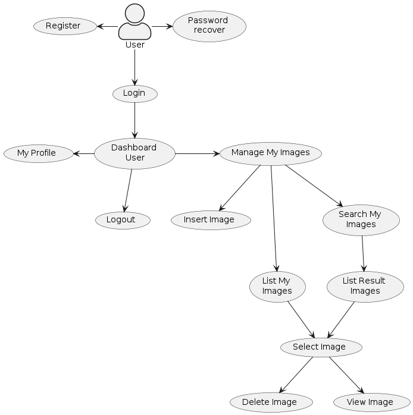
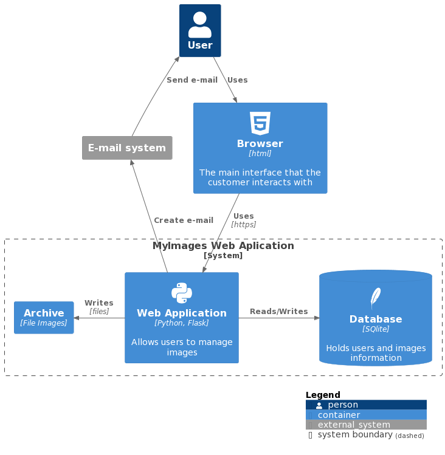
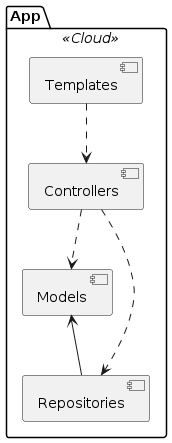

# MyImages

Exemplo de Protótipo de Aplicação Web (Prova de Conceito) de CRUD de usuários e imagens

# A. Ambiente de Desenvolvimento

Existe uma estrutura base que vamos seguir para a construção de nossas aplicações em [Flask](https://flask.palletsprojects.com/en/2.3.x/): 

## 1. Virtual Environment

Vamos usar o esquema de [virtual environment](https://docs.python.org/3/library/venv.html)

```bash
python3 -m venv venv
```

Mais detalhes em [python venv](https://packaging.python.org/en/latest/guides/installing-using-pip-and-virtual-environments/#creating-a-virtual-environment)

### 1.1 Para ativar o venv (Linux e MacOS)

```bash
source venv/bin/activate
```

### 1.2 Para desativar o venv 

```bash
deactivate
```

## 2. Uma vez criado e ativado o venv precisamos instalar os módulos, pacotes e bibliotecas usadas pela aplicação

```bash
pip3 install -r requirements.txt
```

## 3. É preciso configurar as variáveis de ambiente da aplicação

```bash
export FLASK_APP=run.py && export FLASK_ENV=development
```

## 4. Para executar a aplicação principal

```bash
flask run --host=0.0.0.0 --port=5000
```

Abra o browser: http://localhost:5000

# B. Descrição da estrutura da aplicação 

Segue uma breve descrição dos diretórios e arquivos:

**app/**: O diretório raiz da sua aplicação.

**controllers/**: O diretório que contém os controladores ou [blueprints](https://flask.palletsprojects.com/en/2.3.x/blueprints/) da sua aplicação. Os arquivos auth.py e usuarios.py definem as rotas e a lógica associada a cada uma delas.

**models.py**: O arquivo que contém as definições das classes de modelo da sua aplicação. A classe Usuario está definida neste arquivo.

**repository.py**: O arquivo que contém a definição da classe UsuarioRepository, responsável pela manipulação dos dados dos usuários.

**templates/**: O diretório que contém os templates HTML usados para renderizar as páginas da sua aplicação. Os templates estão organizados em subdiretórios, como auth/ e usuarios/, correspondendo aos controladores aos quais eles pertencem.

**README.md**: Um arquivo de documentação contendo informações sobre o projeto.

**requirements.txt**: Um arquivo que lista as dependências do projeto.

**run.py**: O ponto de entrada da aplicação Flask, onde você cria a instância do aplicativo e registra os blueprints.

**usuarios.db**: O arquivo de banco de dados [SQLite](https://www.sqlite.org/docs.html) onde os dados dos usuários são armazenados.

# C. Casos de Uso da Aplicação



# D. Visão Geral da Arquitetura

Esta seção apresenta uma visão geral da arquitetura de software da aplicação "MyImages". Descreve os principais componentes, camadas e fluxo de dados da aplicação, fornecendo uma compreensão geral da estrutura e organização do sistema.

## Abordagem baseada em camadas

A arquitetura da aplicação segue uma abordagem de camadas, separando as responsabilidades e promovendo a modularidade. Ela consiste nos seguintes componentes principais:

### Camada de Apresentação (Presentation Layer):

Responsável por lidar com a interface do usuário e a interação com o cliente.
Composta pelos templates HTML localizados na pasta app/templates, que definem a estrutura e o layout das páginas. Os arquivos de template são renderizados pelo Flask para exibir as informações dinâmicas do sistema.

### Camada de Controle (Controller Layer):

Gerencia as requisições HTTP, processa a lógica de negócios e direciona as ações apropriadas. Implementada nos módulos auth.py, usuarios.py e imagens.py localizados na pasta app/controllers. Os controladores recebem as requisições do cliente, extraem os parâmetros necessários e invocam os serviços correspondentes.

### Camada de Repositório (Repository Layer):

Responsável pela manipulações de dados entre a aplicação e o banco de dados. Implementada nos módulos repository.py localizado na pasta app. Os repositórios fornecem funcionalidades como cadastro de usuários, listagem de usuários, etc. Os repositórios interagem diretamente com o banco de dados SQLite através do módulo sqlite3.

## Diagrama de Componentes

Arquitetura ([C4](https://c4model.com/)) de Alto Nível 



Componentes da Aplicação (Web Application)

```
@startuml
package "App" <<Cloud>> {
  [Controllers]
  [Templates]
  [Models]
  [Repositories]
}
[Controllers] ..> [Templates]
[Controllers] ..> [Models]
[Controllers] ..> [Repositories]
[Models] <-- [Repositories]
@enduml
```



Neste diagrama, temos os seguintes componentes mais importantes:

**Controllers**: Estes componentes são responsáveis por receber as requisições do cliente, manipular os dados necessários e chamar os serviços apropriados. Eles interagem com os componentes Templates, Models e Repositories. No contexto do padrão [MVC](https://en.wikipedia.org/wiki/Model%E2%80%93view%E2%80%93controller), os Controllers atuam como os controladores da aplicação, lidando com a lógica de controle e coordenação das interações entre as outras camadas.

**Templates**: Estes componentes contém os arquivos de templates ou views que são usados para renderizar a interface do usuário. Os templates são populados com os dados fornecidos pelos Controllers e exibidos ao usuário final.

**Models**: Estes componentes contém as classes que representam os objetos de domínio ou entidades da aplicação. Os Models também podem encapsular a lógica de negócio e o estado dos dados. Eles são utilizados pelos Controllers para obter os dados das entidades base.

**Repositories**: Estes componentes são responsáveis pelo acesso e manipulação dos dados persistentes. Os Repositories fornecem uma interface para buscar, criar, atualizar e excluir registros no banco de dados. Eles são utilizados pelos Controllers para realizar operações de persistência.

Essa arquitetura pode ser divida em camadas, seguindo os conceitos do MVC, o que ajuda a separar as responsabilidades da aplicação, tornando o código mais modular, reutilizável e facilitando a manutenção. Os Controllers lidam com a lógica de controle, os Templates cuidam da apresentação e os Models encapsulam as entidades base da aplicação e interagem com os Repositories para acessar os dados persistentes.

## Fluxo de dados de referência

O fluxo de dados na aplicação segue o seguinte padrão:

O cliente (navegador) faz uma requisição HTTP para uma determinada URL, como /login, /cadastrar, /listar, etc.

O Flask, como framework, recebe a requisição e identifica o controlador correspondente com base na rota definida nas rotas registradas.

O controlador processa a requisição, extrai os dados necessários dos parâmetros da requisição ou do formulário enviado pelo cliente.

O controlador invoca o serviço apropriado, passando os dados relevantes.

O serviço realiza as operações necessárias, como cadastro de usuário, autenticação ou consulta ao banco de dados.

O serviço retorna os resultados para o controlador.

O controlador renderiza o template HTML apropriado, passando os dados resultantes para serem exibidos ao cliente.

O Flask envia a resposta HTTP contendo o HTML renderizado de volta para o cliente, que exibe a página ao usuário.

# E. Tecnologias e configurações do projeto

## Tecnologias

Aqui estão as principais tecnologias e frameworks utilizados na aplicação:

**Flask**: Flask é um framework web em Python utilizado para desenvolvimento de aplicações web. Ele fornece recursos para gerenciamento de rotas, renderização de templates, manipulação de requisições e muito mais. É a base da aplicação e permite a criação de uma aplicação web de forma simples e eficiente.

**SQLite**: SQLite é um banco de dados relacional embutido utilizado para armazenar os dados dos usuários cadastrados na aplicação. É uma opção leve e prática para aplicações de pequeno a médio porte.

**HTML**: [HTML](https://en.wikipedia.org/wiki/HTML) (Hypertext Markup Language) é a linguagem de marcação utilizada para estruturar e organizar o conteúdo das páginas web. É a base para a criação dos templates HTML da aplicação.

**CSS**: [CSS](https://en.wikipedia.org/wiki/CSS) (Cascading Style Sheets) é uma linguagem utilizada para estilizar e formatar as páginas web. É utilizada para definir o layout, cores, fontes e outros aspectos visuais da aplicação.

**PlantUML**: [PlantUML](https://en.wikipedia.org/wiki/PlantUML) é uma ferramenta para criação de diagramas UML de forma textual. Foi utilizado para gerar os diagramas de componentes e camadas da aplicação.

Essas são as principais tecnologias e frameworks utilizados na aplicação. Cada uma desempenha um papel importante na construção e funcionamento da aplicação web Flask, desde o framework Flask em si até as linguagens de marcação utilizadas para criar as páginas web.

## Configurações do projeto

**Secret Key**: A configuração da chave secreta (app.secret_key) é fundamental para a segurança da aplicação. Ela é utilizada para assinar as sessões e proteger os dados sensíveis armazenados nelas. Certifique-se de definir uma chave secreta forte e única para cada ambiente de implantação da aplicação.

**Banco de Dados**: A aplicação utiliza o SQLite como banco de dados embutido. Certifique-se de ajustar as configurações do banco de dados de acordo com as necessidades da aplicação, como nome do arquivo de banco de dados e localização.
Autenticação e Autorização: A aplicação implementa um sistema de autenticação básico utilizando nome de usuário e senha. É importante considerar a segurança nessa área, como o armazenamento seguro das senhas (por exemplo, utilizando hash e [salt](https://en.wikipedia.org/wiki/Salt_(cryptography))) e o uso de medidas adicionais, como limitação de tentativas de login e proteção contra ataques de força bruta.

**Proteção CSRF**: É importante adicionar proteção [CSRF](https://en.wikipedia.org/wiki/Cross-site_request_forgery) (Cross-Site Request Forgery) nas rotas que modificam dados sensíveis ou realizam operações destrutivas. O Flask possui recursos embutidos para lidar com CSRF, como o uso do token CSRF na geração de formulários.

**Configurações de Ambiente**: Considere utilizar configurações de ambiente para separar as configurações específicas de cada ambiente, como desenvolvimento, produção e teste. Isso permite que a aplicação seja facilmente configurada em diferentes ambientes sem a necessidade de modificar o código fonte.

**Controle de Acesso**: Além da [autenticação](https://en.wikipedia.org/wiki/Authentication), é importante considerar o [controle de acesso](https://en.wikipedia.org/wiki/Authorization) em nível de permissões de usuário. Isso pode envolver a definição de papéis de usuário (por exemplo, administrador, usuário comum) e a restrição de acesso a determinadas funcionalidades ou recursos com base nas permissões associadas a cada papel.

# F. Testes da Aplicação

Existem vários tipos de testes de software que podem ser aplicados durante o processo de desenvolvimento para garantir a qualidade do software. Logo abaixo seguem os tipos de testes que deverão ser feitos para garantir a qualidade da nossa aplicação. 

## Tipos de Testes

### Testes Unitários

É realizado para verificar se as unidades individuais de código (geralmente funções, métodos ou classes) funcionam corretamente. O objetivo é testar cada unidade isoladamente para identificar possíveis erros lógicos ou funcionais. Geralmente, é executado pelos desenvolvedores.

[Casos de Testes Unitários](https://github.com/my-prototypes/tflk/blob/main/docs/testes.md)

### Testes de Integração

Tem como objetivo verificar se as diferentes unidades do software se integram corretamente e funcionam em conjunto. Verifica se a comunicação entre as unidades é eficiente e se os dados são transferidos corretamente. Pode ser realizado em diferentes níveis de integração, como integração de módulos, integração de subsistemas ou integração do sistema como um todo.

[Casos de Testes de Integração](https://github.com/my-prototypes/tflk/blob/main/docs/testes.md)

### Testes de Sistema

É realizado para avaliar o sistema como um todo e verificar se ele atende aos requisitos especificados. Verifica se todas as funcionalidades estão implementadas corretamente, se a interação entre os componentes é adequada e se o sistema funciona conforme o esperado em diferentes cenários e condições.

[Casos de Testes de Sistema](https://github.com/my-prototypes/tflk/blob/main/docs/testes.md)

### Testes de Aceitação

É conduzido para verificar se o software atende aos critérios de aceitação definidos pelo cliente ou usuário final. Geralmente, é realizado em um ambiente próximo ao ambiente de produção. O objetivo é validar se o software está pronto para ser entregue e utilizado pelos usuários finais.

[Roteiro para criar os testes de aceitação](https://github.com/my-prototypes/tflk/blob/main/docs/roteiro_testes_aceitacao.md)

### Testes de Regressão

É realizado após modificações no software para garantir que as alterações não tenham introduzido novos defeitos ou afetado o funcionamento das funcionalidades existentes. Visa garantir que as partes do software que estavam funcionando corretamente antes das alterações ainda funcionem conforme o esperado.

[Roteiro para criar os testes de Regressão](https://github.com/my-prototypes/tflk/blob/main/docs/roteiro_testes_regressao.md)

### Testes de Desempenho

Tem como objetivo avaliar o desempenho do software em termos de tempo de resposta, capacidade de processamento, escalabilidade e estabilidade sob diferentes cargas de trabalho. Ajuda a identificar gargalos, otimizar o desempenho e garantir que o software possa lidar com a demanda esperada.

[Roteiro para criar os testes de Desempenho](https://github.com/my-prototypes/tflk/blob/main/docs/roteiro_testes_desempenho.md)

### Testes de Segurança

É realizado para identificar vulnerabilidades de segurança no software. Visa garantir que o software seja resistente a ataques e que as informações sejam protegidas adequadamente. Envolve testes de penetração, testes de autenticação, testes de autorização e outros métodos de avaliação de segurança.

[Roteiro para criar os testes de segurança](https://github.com/my-prototypes/tflk/blob/main/docs/roteiro_testes_seguranca.md)

## Exemplo de Plano de Testes

[Plano de Testes](https://github.com/my-prototypes/tflk/blob/main/docs/plano_de_testes.md)

## Exemplo de resultados de testes

[Protótipo 1 - resultados](https://github.com/my-prototypes/tflk/blob/main/docs/resultados_testes_prototipo1.csv)

[Protótipo 2 - resultados](https://github.com/my-prototypes/tflk/blob/main/docs/resultados_testes.csv)

# G. Esquema de controle de branches

Definir um esquema de controle de versão e criar branches de desenvolvimento é fundamental no desenvolvimento de software colaborativo usando o Git por várias razões:

1. Separação de funcionalidades: Ao criar branches de desenvolvimento para implementar as features da aplicação, cada funcionalidade pode ser desenvolvida de forma isolada em seu próprio branch. Isso permite que diferentes desenvolvedores trabalhem em diferentes funcionalidades ao mesmo tempo, sem interferir no código uns dos outros.

2. Isolamento de alterações: Cada branch de desenvolvimento contém apenas as alterações relacionadas a uma determinada funcionalidade. Isso facilita a revisão de código, depuração e a identificação de problemas, pois as alterações são limitadas a um escopo específico.

3. Versionamento independente: Cada branch de desenvolvimento permite que as alterações sejam versionadas de forma independente. Isso significa que é possível controlar o histórico de commits e realizar rollbacks específicos para cada funcionalidade, sem afetar o restante do código.

4. Facilidade de colaboração: Com um esquema de controle de versão bem definido e branches de desenvolvimento, vários desenvolvedores podem trabalhar simultaneamente em diferentes funcionalidades sem conflitos diretos. Eles podem compartilhar suas alterações por meio de pull requests e revisar o código uns dos outros antes de mesclar as alterações no branch principal.

5. Estabilidade do código principal: O branch principal, geralmente chamado de "master" ou "main", é mantido em um estado estável, contendo apenas as funcionalidades concluídas e testadas. Isso permite que outras equipes ou partes interessadas tenham acesso a uma versão funcional e estável da aplicação.

[Exemplo de roteiro para implementação das features](https://github.com/my-prototypes/tflk/blob/main/docs/guia_branches.md)
